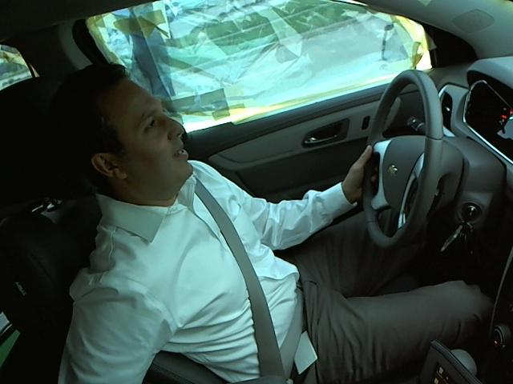
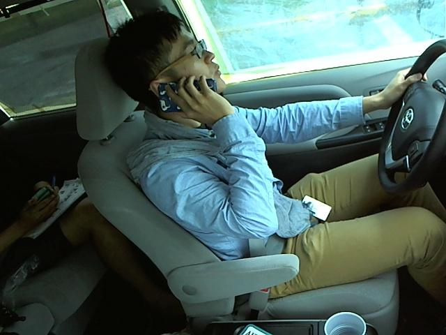
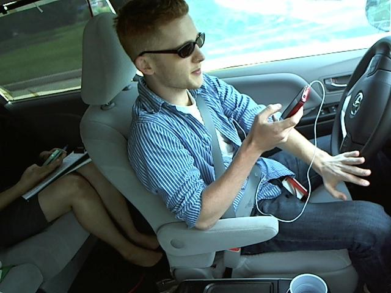

# Distracted Driver Detection

### Problem Definition:
Given Statefarm dataset of 2D dashboard car images , this kaggle challenge gives task of classifying each driver's behavior.
These are some examples:
  
The images are labeled following a set of 10 categories:

|Class|Description|
|-----|-----------|
| `c0` | Safe driving. |
| `c1` | Texting (right hand). |
| `c2` | Talking on the phone (right hand). |
| `c3` | Texting (left hand). |
| `c4` | Talking on the phone (left hand). |
| `c5` | Operating the radio. |
| `c6` | Drinking. |
| `c7` | Reaching behind. |
| `c8` | Hair and makeup. |
| `c9` | Talking to passenger(s). |

### Dependencies

* `Python 3.6.1`
* `Tensorflow 1.3.0`
* `Keras 2.1.2`
* `matplotlib 2.0.2`
* `numpy 1.12.1`
